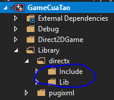

# Castlevania

## Project Configuration (Visual studio)

Here are some configurations you may want to change to build the project successfully (using Visual Studio).
Open the project settings by selecting the current project, right click and choose `Properties`

-  Convert string in legacy code API: `General` -> `Character Set` -> `Use Unicode Character Set`
-  Set C++ standard version to the minimum (C++17): `C/C++` -> `Language` -> `C++ Language Standard` -> `C++17 Standard`
-  Enable [native event] _'feature'_: `C/C++` -> `Language` -> `Conformance mode` -> Leave Empty
-  To use DirectSound framework: `C/C++` -> `Preprocessor` -> `Preprocessor Definitions` -> Add `_CRT_SECURE_NO_WARNINGS`

Also take a look at the following places and copy from the [sample project] if
there are still errors

-  `General` -> `Windows SDK Version` -> Latest Version
-  `VC++ Directories` -> `Include Directories`
-  `VC++ Directories` -> `Library Directories`

### How to add DirectX SDK to your project

-  Step 1: Install DirectX SDK

-  Step 2: Go to DirectX SDK installation path


-  Step 3: Copy into your game project. Something like this



-  Step 4: Reconfigure Include and Library directory to the new relative path


-  Step 5: Add those lib files in the Lib folder to Linker input

Go to `Configuration Properties` -> `Linker` -> `Input` -> `Additional Dependencies` and add

```
d3d9.lib;d3dx9.lib;dinput8.lib;dxguid.lib;dsound.lib;dxerr.lib;winmm.lib;%(AdditionalDependencies);legacy_stdio_definitions.lib
```

### How to add third-party dll files

-  Go to `Configuration Properties` -> `Build Events` -> `Post-Build Event`
-  Add this line in the Command Line

```
XCOPY "$(ProjectDir)\lib\*.dll" "$(TargetDir)" /D /K /Y
```

By default, Visual Studio only copy `*.dll` files in the `$(ProjectDir)`. If you put
them in some subfolder, you have to specify the path manually to that subfolder
(in this case `lib\`) so Visual Studio know where to find and copy them

### Fix linker error when having 2 files with the same name

```
LNK4042: object specified more than once; extras ignored
```

-  Go to `Configuration Properties` -> `C/C++` -> `Output Files` -> `Object File Name` -> `$(IntDir)/%(RelativeDir)/`

With the default configuration, Visual will toss all object files into one big folder, leading to name conflict if there are source files with the same name in different folders, replace to `$(IntDir)/%(RelativeDir)/` will put those object files in a mirror source tree, solving name conflicts

## Development Environment

-  Visual Studio 2017
-  C++17

### Libraries

-  [DirectX 9 SDK]
-  [pugixml] - Light-weight, simple and fast XML parser for C++
-  [freetype] - A freely available software library to render fonts

[sample project]: https://github.com/dungdna2000/gamedev-intro-tutorials/

## References

-  [Back to the Basics! Essentials of Modern C++ Style]
-  [Smart pointers need careful programmers]
-  [UIT-SE102-Game-Project ]
-  [Game Programming Patterns]
-  [Monogame Framework]
-  [Monogame Samples]
    - [CatapaultWars]
    - [NetRumble]
    - [RolePlayingGame]

[native event]: https://msdn.microsoft.com/en-us/library/ee2k0a7d.aspx

[back to the basics! essentials of modern c++ style]: https://github.com/CppCon/CppCon2014/blob/master/Presentations/Back%20to%20the%20Basics!%20Essentials%20of%20Modern%20C%2B%2B%20Style/Back%20to%20the%20Basics!%20Essentials%20of%20Modern%20C%2B%2B%20Style%20-%20Herb%20Sutter%20-%20CppCon%202014.pdf
[smart pointers need careful programmers]: https://yatb.giacomodrago.com/en/post/11/cpp11-smart-pointers-need-careful-programmers.html
[uit-se102-game-project ]: https://github.com/danhph/UIT-SE102-Game-Project
[game programming patterns]: http://gameprogrammingpatterns.com/contents.html
[monogame framework]: https://github.com/MonoGame/MonoGame
[monogame samples]: https://github.com/CartBlanche/MonoGame-Samples
[CatapaultWars]: https://github.com/CartBlanche/MonoGame-Samples/tree/master/CatapaultWars
[NetRumble]: https://github.com/CartBlanche/MonoGame-Samples/tree/master/NetRumble
[RolePlayingGame]: https://github.com/CartBlanche/MonoGame-Samples/tree/master/RolePlayingGame

[directx 9 sdk]: https://www.microsoft.com/en-us/download/details.aspx?id=6812
[pugixml]: https://github.com/zeux/pugixml/
[freetype]: https://github.com/ubawurinna/freetype-windows-binaries

[create smart pointer from raw pointer]: https://stackoverflow.com/questions/4665266/creating-shared-ptr-from-raw-pointer