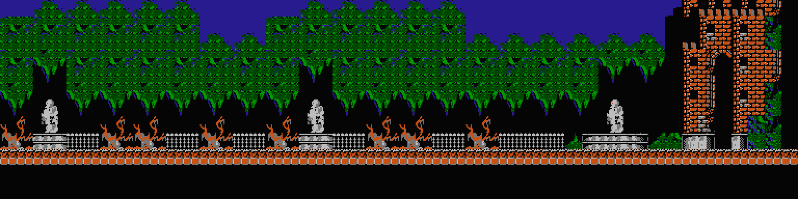

## Download

--> [Link](http://www.tilemap.co.uk/mappy.php)

## Create tileset from Mappy

*Note*: To load `*.png` file from Mappy download and install this [extension](http://www.tilemap.co.uk/pngfiles.html)

Usually, to create tile-based map (or tiled map), game designer needs a predefined tileset like this


From that tileset, a designer can combine different tiles to make a whole map


Since we are remaking the game. We already have the game and the background image, what we need to do is to reverse engineer and create the tileset. That's where Mappy comes into play - to create a tileset from a finished tiledmap

In this tutorial, I will use Courtyard map as an example. [Link to image](src/GameCuaTao/Castlevania/Content/TiledMaps/Stage_01/Courtyard.png)



To create Courtyard tileset in Mappy. We need to determine the width and height in pixel of a tile. Zoom in a bit and have a closer look we will see some duplicated regions in your map. After fiddling around, you will notice that each tile is exactly 64x64 pixel


The map size is 1536x384, so each row can hold 1536/64 = 24 tiles. Similarly, each column hold 384/64 = 6 tiles

Open Mappy `File` > `New Map...` > fill in the size of each tile and how many tiles the map can hold


Now go to `MapTools` > `Useful functions:` > `Create map from big picture` > Select image


The screen on the right hold every single tiles from the map on the left (after removing duplicated block)

Finally, we can export the tiled map info (in matrix form)

`File` > `Save`

`File` > `Export` >
* Check `Map array as comma values only`
* Check `Graphics Blocks as picture` > `OK`


After exporting 2 new files are created:
- A tileset image in BMP (bitmap) format
- A `*.csv` that hold the tiled map data in matrix that should look like this.


Each number in the matrix is a tile id at a given position in the map. Here is the previous picture for comparison


## Code sample

Here is a sample implementation of tiled map in Typescript. The game will only draw tiles that are within the viewport

```ts
class Viewport {
    left: number;
    top: number;
    bottom: number;
    right: number;
}

class Tile {
    static width = 64;
    static height = 64;

    Tile(
        public image: Bitmap,
        public left: number,
        public top: number,
        public width: number,
        public height: number
    ) {}
}

class TiledMap {
    static width = 24; // each row holds 24 tiles
    static height = 6; // each column holds 6 tiles
    Array<Array<Tile>> tiles = [];

    load() {
        // [1, 2, 2, 2, 2, ...]
        var tileSetData = Csv.load('/path/to/my-tiledmap.CSV');
        var tileSetImage = new Bitmap('/path/to/my-tileset.BMP');
        var tilesPerRow = tileSetImage.width / Tile.width; // number of tiles per row in tileset image

        tiles.push(new Array<Tile>());
        tileSetData.forEach((tileId) => {
            var tile = new Tile(
                tileSetImage,
                Tile.width * (tileId % tilesPerRow),
                Tile.height * (tileId / tilesPerRow),
                Tile.width,
                Tile.height,
            );
            tiles[row].push(tile);
            column = ++column % width;

            if (column == 0) {
                tiles.push(new Array<Tile>());
                row++;
            }
        });
    }
}

class Game {
    map: TiledMap = new TiledMap();

    loadMap() {
        map.load();
    }

    clamp(value, min, max) {
        if (value > max) return max;
        if (value < min) return min;
        return value;
    }

    draw(viewport: Viewport) {
        // draw tiles within the viewport only
        var rowStart = viewport.top / Tile.height;
        var rowEnd = viewport.bottom / Tile.height;
        var columnStart = viewport.left / Tile.width;
        var columnEnd = viewport.right / Tile.width;

        // make sure you dont draw outside of tiled map
        rowStart = clamp(rowStart, 0, TiledMap.width - 1);
        rowEnd = clamp(rowEnd, 0, TiledMap.width - 1);
        columnStart = clamp(columnStart, 0, TiledMap.height - 1);
        columnEnd = clamp(columnEnd, 0, TiledMap.height - 1);

        for (var row = rowStart; row <= rowEnd; row++)
        {
            for (var column = columnStart; column <= columnEnd; column++)
            {
                var tile = map.tiles[row][column];
                // Draw tile
            }
        }
    }
}
```